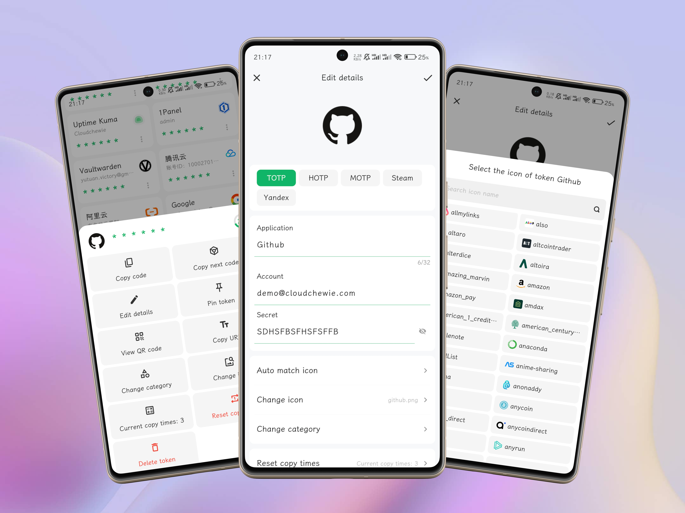
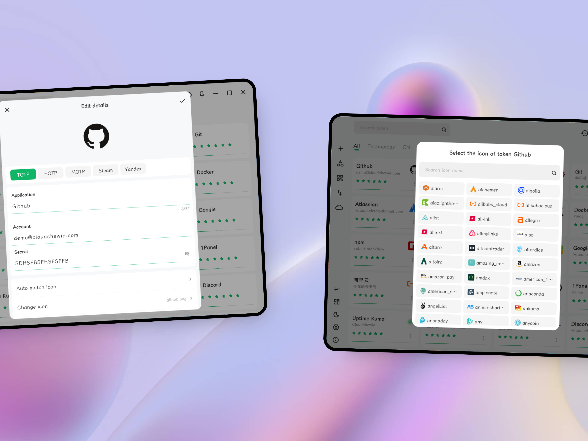

{/* 

  
   
  
  
     
    
    

 */}

## Quick Links

<Cards>
  <Card title="Downloads" href="/changelog" icon={<DownloadIcon/>}>
    Download CloudOTP for various platforms including Windows, macOS, and Linux.
  </Card>
  <Card title="Import and Export" href="/docs/import-export/import" icon={<FileText/>}>
    Instructions for importing and exporting tokens using JSON, URI, or encrypted files.
  </Card>
  <Card title="User Guide" href="/docs/guides/about-otp" icon={<BookOpen />} >
    Comprehensive guides to help you use CloudOTP features efficiently.
  </Card>
  <Card title="Cloud Backup" href="/docs/cloud-backup/onedrive" icon={<Settings />} >
    Set up and manage cloud backups for OneDrive, Google Drive, and other services securely.
  </Card>
</Cards>

## Features

- Based on Flutter architecture refactoring, support for Android and Windows, will gradually support more platforms in the future
- Support TOTP, HOTP, MOTP, Steam and Yandex.
- Supports scanning code to add, recognizing pictures, and manually inputting keys.
- Supports customized icons and categories, sorting and multiple token layouts.
- Supports dark color mode, multiple languages, and multiple themes.
- Support local backup and automatic backup, support WebDav, Onedrive, GoogleDrive, Dropbox, S3 storage and other cloud backup methods.
- Supports import/export of encrypted files and URI lists.
- Supports database encryption, gesture password, fingerprint unlocking.

## Preview for Android

## Preview for Windows

